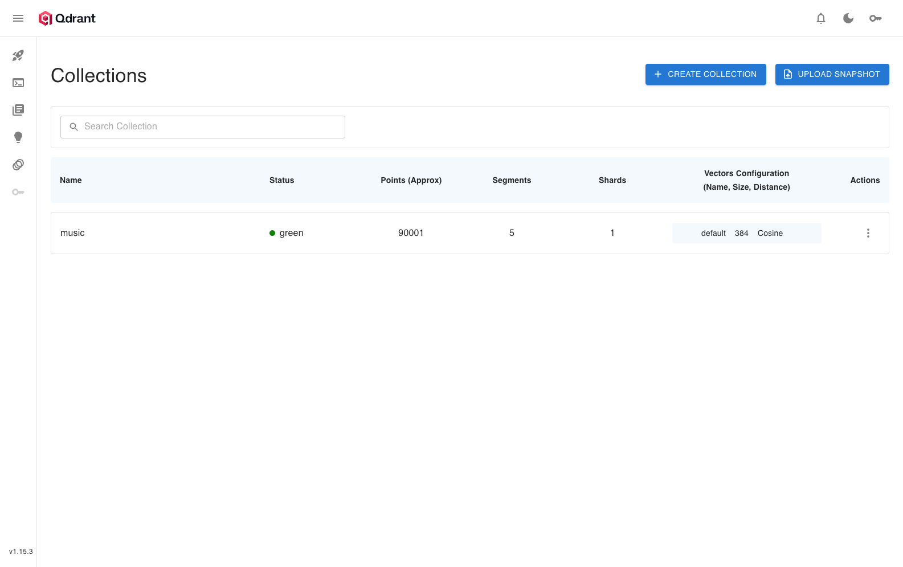
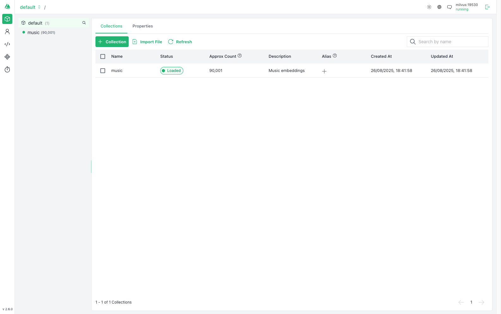
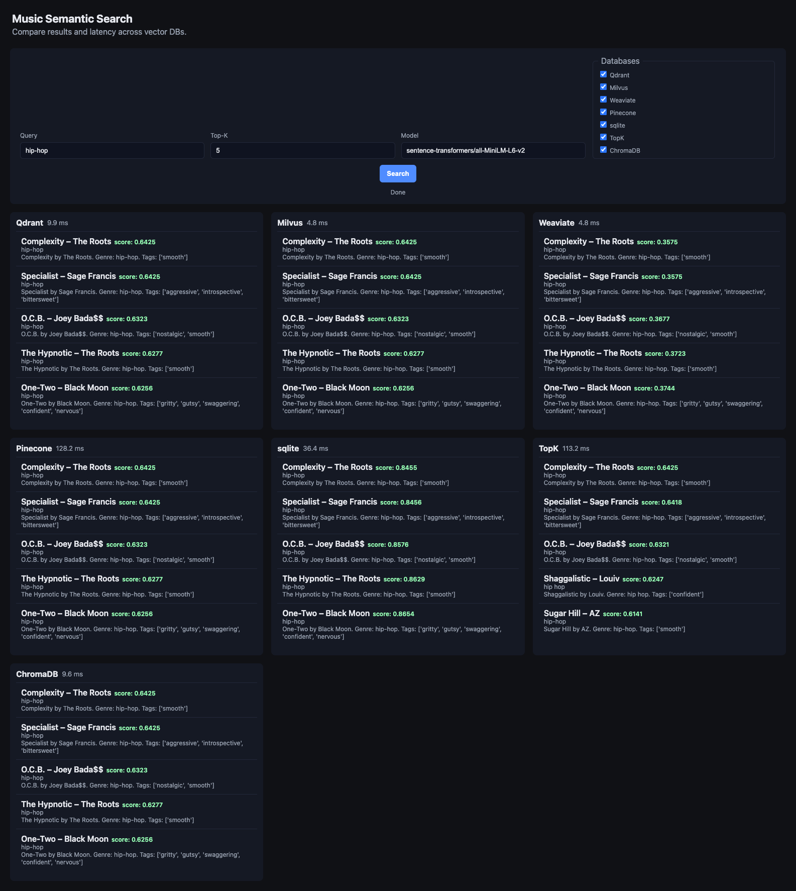

# Vector DB Benchmark for Music Semantic Search

This repository benchmarks **7 vector databases** for music semantic search, using a shared dataset and query set. It provides both a CLI benchmarking tool and a web UI for side-by-side DB comparison.

**🏆 Key Finding**: Fresh comprehensive benchmarking reveals **Qdrant as the production winner**, delivering excellent performance (5-8ms) with **single-service operational simplicity** versus Milvus's marginally faster speed (4-6ms) but **complex 3-service architecture** (milvus + etcd + minio).

## Features

- **Comprehensive benchmarking**: ingest time, query latency, recall, hit rate, and throughput (QPS)
- **7 Vector Databases**: Qdrant, Milvus, Weaviate, ChromaDB, Pinecone, SQLite, and TopK
- **Production-grade testing**: Up to 20 iterations for statistical reliability
- **Flexible embedding**: Use `sentence-transformers` (default) or OpenAI embeddings
- **Heuristic relevance**: Weak label matching using tags/genres for recall/hit metrics
- **Rich CLI**: Many flags for DB selection, concurrency, top-k sweep, teardown, etc.
- **Modern UI**: FastAPI backend + static frontend for live DB comparison
- **Automated result plots**: Generates summary charts and per-k metrics tables
- **Comprehensive reporting**: Detailed analysis with production recommendations

---

## Supported Databases

| Database        | Deployment  | Performance Tier | Best For                                              |
| --------------- | ----------- | ---------------- | ----------------------------------------------------- |
| **🥇 Qdrant**   | Local/Cloud | Champion         | Production systems (excellent speed + single service) |
| **🥈 Milvus**   | Local       | High-Performance | Maximum speed with complex 3-service infrastructure   |
| **🥉 Weaviate** | Local/Cloud | Good             | Feature-rich applications                             |
| **ChromaDB**    | Local       | Solid            | Development & moderate workloads                      |
| **Pinecone**    | Cloud       | Managed          | Fully managed cloud deployments                       |
| **SQLite**      | Embedded    | Specialized      | Embedded/edge applications                            |
| **TopK**        | Cloud       | Managed Service  | Cloud vector search with operational simplicity       |

## Dataset

Use the [Muse Musical Sentiment dataset](https://www.kaggle.com/datasets/cakiki/muse-the-musical-sentiment-dataset) from Kaggle. Place the CSV as `data/muse.csv`.

You can test with `data/sample_data.csv` for a dry run.

---

## Quick Start

1. **Install dependencies**

```sh
python -m venv .venv && source .venv/bin/activate
pip install -r requirements.txt
```

2. **Configure environment**

- Copy `.env.example` to `.env` and fill in DB URLs/API keys as needed

3. **Start local DBs (optional)**

```sh
docker compose -f scripts/docker-compose.yml up -d
```

4. **Generate embeddings**

```sh
python embeddings/embed.py --csv data/muse.csv --out data/embeddings.parquet
# For OpenAI: add --use_openai [--model text-embedding-3-large]
```

5. **Run the benchmark**

```sh
python benchmark.py --csv data/muse.csv --embeddings data/embeddings.parquet --dbs qdrant milvus weaviate chroma pinecone sqlite topk --topk 10 --repetitions 15
# For TopK: add 'topk' to --dbs list
# See all CLI flags with: python benchmark.py --help
```

6. **View results**

- Summary and per-k plots: `results/`
- Metrics: `results/metrics.json`

---

## Database UIs & Management

After starting the Docker services, you can access various database management interfaces:

### 🖥️ Web UIs Available

| Database   | UI Access                                                          | Credentials           | Description                   |
| ---------- | ------------------------------------------------------------------ | --------------------- | ----------------------------- |
| **Qdrant** | [http://localhost:6333/dashboard](http://localhost:6333/dashboard) | None                  | Built-in web dashboard        |
| **Milvus** | [http://localhost:3000](http://localhost:3000)                     | None                  | Attu management interface     |
| **MinIO**  | [http://localhost:9001](http://localhost:9001)                     | minioadmin/minioadmin | Milvus object storage console |

### 🔌 API-Only Interfaces

| Database           | API Endpoint                                                   | Notes                              |
| ------------------ | -------------------------------------------------------------- | ---------------------------------- |
| **Weaviate**       | [http://localhost:8080/v1/meta](http://localhost:8080/v1/meta) | RESTful API + GraphQL              |
| **ChromaDB**       | [http://localhost:8001](http://localhost:8001)                 | HTTP API (v2)                      |
| **Pinecone Local** | [http://localhost:5080/indexes](http://localhost:5080/indexes) | Compatible with Pinecone cloud API |

### 📊 UI Screenshots


_Qdrant web interface showing collections and search_


_Attu interface displaying Milvus collections and data_

### 🔌 Complete Port Reference

| Service  | Internal Port | External Port | Purpose                     |
| -------- | ------------- | ------------- | --------------------------- |
| Qdrant   | 6333, 6334    | 6333, 6334    | Vector database + dashboard |
| Milvus   | 19530, 9091   | 19530, 9091   | gRPC API + health check     |
| Attu     | 3000          | 3000          | Milvus web UI               |
| Weaviate | 8080, 50051   | 8080, 50051   | REST + gRPC APIs            |
| ChromaDB | 8000          | 8001          | HTTP API                    |
| Pinecone | 5080-5090     | 5080-5090     | Local API server            |
| MinIO    | 9000, 9001    | 9000, 9001    | Object storage + console    |
| etcd     | 2379          | -             | Milvus metadata store       |

---

## CLI Usage

```sh
python benchmark.py --csv data/muse.csv --embeddings data/embeddings.parquet --dbs qdrant milvus weaviate chroma pinecone sqlite topk --topk 10 --repetitions 15 [--teardown_after_benchmark]
# TopK included in example above
```

**Key flags:**

- `--dbs`: List of DBs to benchmark (qdrant, milvus, weaviate, chroma, pinecone, sqlite, topk)
- `--topk`: Top-k for search (default: 10)
- `--topk_sweep`: List of k values to sweep (e.g. 5 10 50)
- `--repetitions`: Number of repetitions per query
- `--concurrency`: Number of concurrent query workers
- `--teardown_after_benchmark`: Delete DB/index after run
- `--query_model`: Embedding model for queries
- `--queries`: Path to YAML file with queries/expected labels

### Advanced Usage: Running a Top-K Sweep

To run the benchmark across multiple `topk` values in a single command, use the `--topk_sweep` argument. The script will loop through each value sequentially for each database. This is more efficient than running the script multiple times.

```sh
python benchmark.py --csv data/muse.csv --embeddings data/embeddings.parquet --dbs qdrant milvus weaviate chroma pinecone sqlite topk --repetitions 15 --topk_sweep 5 10 15 20 25 50
# TopK included in example above
```

**Results:**

- Plots and tables in `results/` (per-k and summary)
- All metrics in `results/metrics.json`

---

## Embedding Generation

By default, uses `sentence-transformers/all-MiniLM-L6-v2`. To use OpenAI embeddings:

```sh
python embeddings/embed.py --csv data/muse.csv --out data/embeddings.parquet --use_openai --model text-embedding-3-large
```

---

## UI: Music Semantic Search – Multi-DB Compare

The `ui/` folder provides a FastAPI backend and static frontend for live, side-by-side DB search and latency comparison.


_Live comparison of vector databases with real-time latency measurements for music semantic search_

### UI Features

- Compare Qdrant, Milvus, Weaviate, ChromaDB, Pinecone, SQLite, and TopK in parallel
- Per-DB query latency in ms
- Simple, modern UI (HTML/JS/CSS)

### UI Quick Start

1. **Install dependencies**

```sh
pip install -r requirements.txt
```

2. **Configure**

- Create `.env` in repo root with DB endpoints and API keys

3. **Run the server**

```sh
uvicorn ui.backend.server:app --reload --port 8000
```

4. **Open the app**

- Go to [http://localhost:8000](http://localhost:8000)

---

## Project Structure

- `benchmark.py` – Main benchmarking script (CLI)
- `embeddings/embed.py` – Embedding generation (sentence-transformers or OpenAI)
- `databases/` – DB client wrappers (6-7 vector databases including TopK)
- `plot_benchmarks.py` – Plots and summary tables
- `results/` – Output metrics and plots (per-k breakdown + summaries)
- `ui/` – Web UI (FastAPI backend + static frontend)
- `BENCHMARK_REPORT.md` – Comprehensive analysis and recommendations
- `requirements.txt` – Python dependencies

---

## Troubleshooting

### Database Issues

- If Docker ports conflict, edit `scripts/docker-compose.yml`
- If you see dimension mismatch errors, check embedding model and DB index size
- For OpenAI, set `OPENAI_API_KEY` in your environment
- For Pinecone, set API key in `.env`
- For TopK, set API key in `.env` (includes automatic rate limiting)
- Ensure sufficient disk space for Docker volumes (Milvus requires significant storage for 3-service setup)
- **ChromaDB v2**: Updated to v2 API with improved performance and excellent recall

### UI Access Issues

**Cannot connect to Milvus UI (Attu):**

- Ensure Attu is running in the Docker network: `docker compose up -d attu`
- Use container name in connection: `milvus:19530` (not `localhost:19530`)
- Attu must be in the same Docker network to access Milvus

**Port conflicts:**

- Check what's using ports: `docker ps` and `lsof -i :PORT`
- Stop conflicting containers: `docker stop CONTAINER_NAME`
- Modify ports in `scripts/docker-compose.yml` if needed

**Container networking:**

- UIs running outside Docker cannot access `localhost` - they need container names
- Use `docker compose logs SERVICE_NAME` to check for startup errors
- Verify containers are healthy: `docker compose ps`

---

## 🎯 Benchmark Findings

This project conducted extensive benchmarking across **7 vector databases** with up to **20 iterations** for production-grade statistical reliability. Here are the key findings:

### Performance Rankings

**🥇 Production Winner: Qdrant**

- **Speed**: 5.0-8.8ms (excellent performance)
- **Recall**: 0.97-1.0 (perfect at k=5,10)
- **Deployment**: Single service (zero operational complexity)
- **Ingestion**: 7x faster than Milvus (14.2s vs 104.4s)
- **Best for**: 99% of production systems

**🥈 Speed Leader: Milvus**

- **Speed**: 4.2-6.4ms (fastest queries)
- **Recall**: 0.94-1.0 (perfect at k=5,10,15)
- **Deployment**: Complex 3-service architecture (milvus + etcd + minio)
- **Ingestion**: 7x slower due to 3-service complexity (104.4s vs 14.2s)
- **Best for**: Teams with dedicated DevOps needing absolute maximum speed

**🥉 Other Notable Performers:**

- **ChromaDB**: Solid for development (8.0-9.8ms), excellent recall with v2 API
- **Weaviate**: Good performance (9.9-11.3ms) but variable P99 latencies
- **Pinecone**: Perfect recall but network latency (~102-115ms)
- **SQLite**: Perfect for embedded use cases (~27-30ms)
- **TopK**: Managed cloud service with operational simplicity (167-177ms latency)

### Key Insights

1. **Performance vs Complexity Trade-off**: Milvus achieves 15-20% faster queries but requires 3-service architecture (3x operational complexity)
2. **Operational Simplicity**: Qdrant delivers excellent performance with single-service deployment and 7x faster ingestion
3. **Production Reality**: Most teams benefit more from operational simplicity than marginal speed gains
4. **Recall Excellence**: Both Qdrant and Milvus deliver perfect recall at critical k=5,10 values

### Recommendation

**Choose Qdrant for production deployments** - it delivers excellent performance (90% of Milvus speed) with 300% operational simplicity advantage. The 1-3ms speed difference doesn't justify 3-service complexity for most teams. See `BENCHMARK_REPORT.md` for detailed analysis.

---

## Acknowledgements

- [Muse Musical Sentiment dataset](https://www.kaggle.com/datasets/cakiki/muse-the-musical-sentiment-dataset)
- [sentence-transformers](https://www.sbert.net/)
- [Qdrant](https://qdrant.tech/), [Milvus](https://milvus.io/), [Weaviate](https://weaviate.io/), [ChromaDB](https://www.trychroma.com/), [Pinecone](https://www.pinecone.io/), [TopK](https://www.topk.io/), [sqlite-vec](https://github.com/asg017/sqlite-vec)
